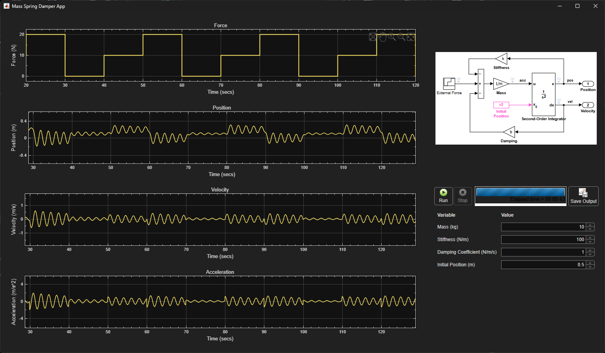

# Developing a Mass Spring Damper App using MVC Architecture and Simulink

This repository contains the MATLAB® code for the article [Developing a Mass Spring Damper App using MVC Architecture and Simulink](). The article provides a short guide for developing a MATLAB app to control and simulate a Simulink® model. The app is built using the [model-view-controller](https://github.com/mathworks/matlab-model-view-controller) (MVC) architecture and can be deployed as a web app using [Simulink Compiler](https://www.mathworks.com/products/simulink-compiler.html)&trade;.

## Installation and Getting Started
The examples are provided as a [MATLAB toolbox](https://www.mathworks.com/help/matlab/matlab_prog/create-and-share-custom-matlab-toolboxes.html).
1. Download the toolbox installer (the `Mass_Spring_Damper_MVC_App.mltbx` file) from the `Releases` section on GitHub.
2. Double-click on the `Mass_Spring_Damper_MVC_App.mltbx` file to install the toolbox.
3. Run `>> MassSpringDamperApp` to launch the app.

### [MathWorks](https://www.mathworks.com) Product Requirements

This example was created using MATLAB release R2026a.

- [MATLAB&reg;](https://www.mathworks.com/products/matlab.html)
- [Simulink&reg;](https://www.mathworks.com/products/simulink.html)
- [Simulink Compiler&trade;](https://www.mathworks.com/products/simulink-compiler.html)

## License
The license is available in the [license.txt](license.txt) file in this GitHub repository.

## Community Support
[MATLAB Central](https://www.mathworks.com/matlabcentral)

Copyright 2025-2026 The MathWorks, Inc.